# 🚨 AWS CloudWatch Monitoring & SNS Alerting System - Project 7

---

## 📌 Overview

This project demonstrates a **real-time monitoring and alerting system** using AWS services.

An EC2 instance is continuously monitored using **Amazon CloudWatch**, and when CPU usage exceeds a threshold, an alert is triggered via **Amazon SNS (email notification)**.

---

## 🏗️ Architecture Diagram

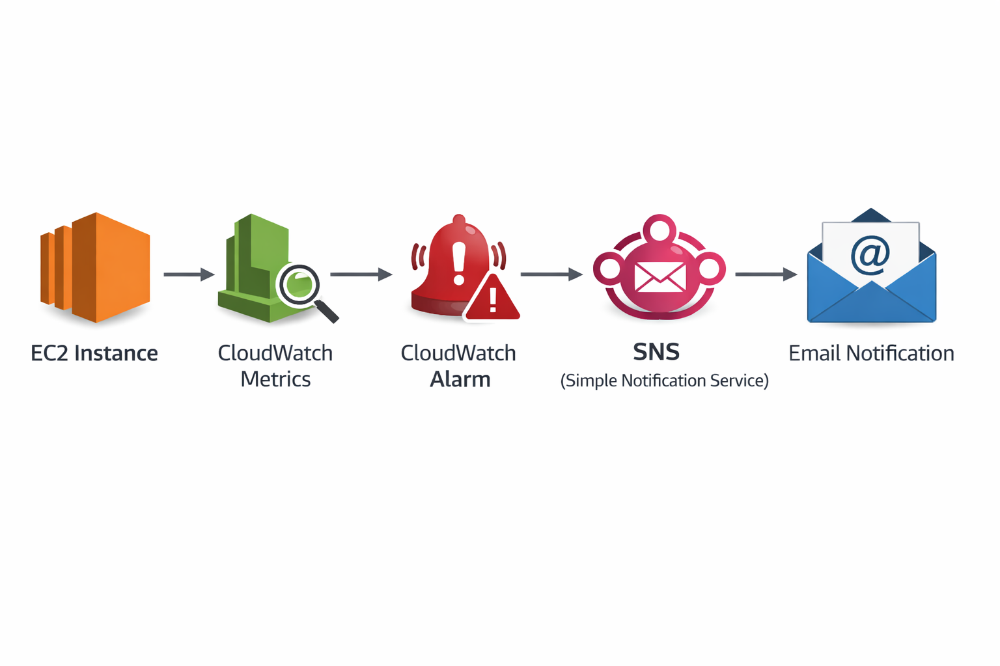

---

## 🎯 Objective

- Monitor EC2 CPU utilization in real time
- Configure CloudWatch alarms with thresholds
- Trigger alerts using SNS email notifications
- Simulate high CPU load using stress testing
- Build end-to-end AWS monitoring pipeline

---

## 🧰 AWS Services Used

- Amazon EC2
- Amazon CloudWatch
- Amazon SNS (Simple Notification Service)
- Amazon Linux (SSH access)

---

## ⚙️ Implementation Steps

### 1. EC2 Instance Running
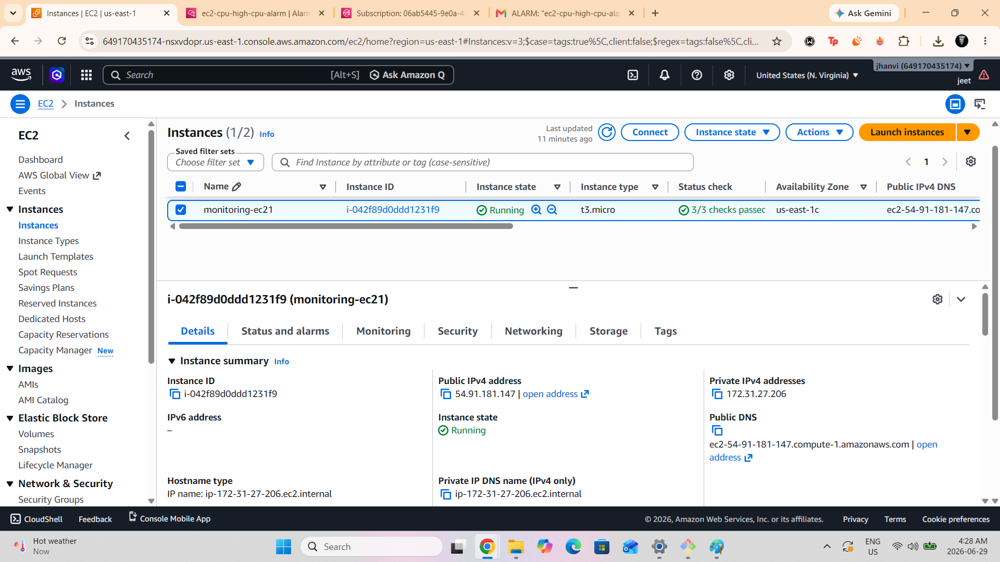
EC2 instance successfully launched and running.

---

### 2. CloudWatch Alarm Created
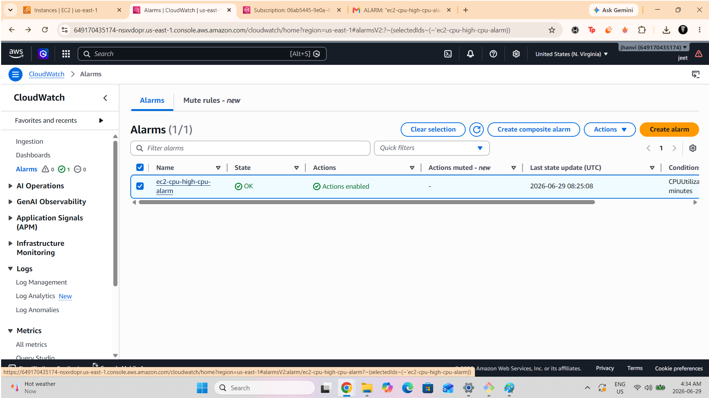
CloudWatch alarm configured for CPUUtilization metric.

---

### 3. Alarm Configuration
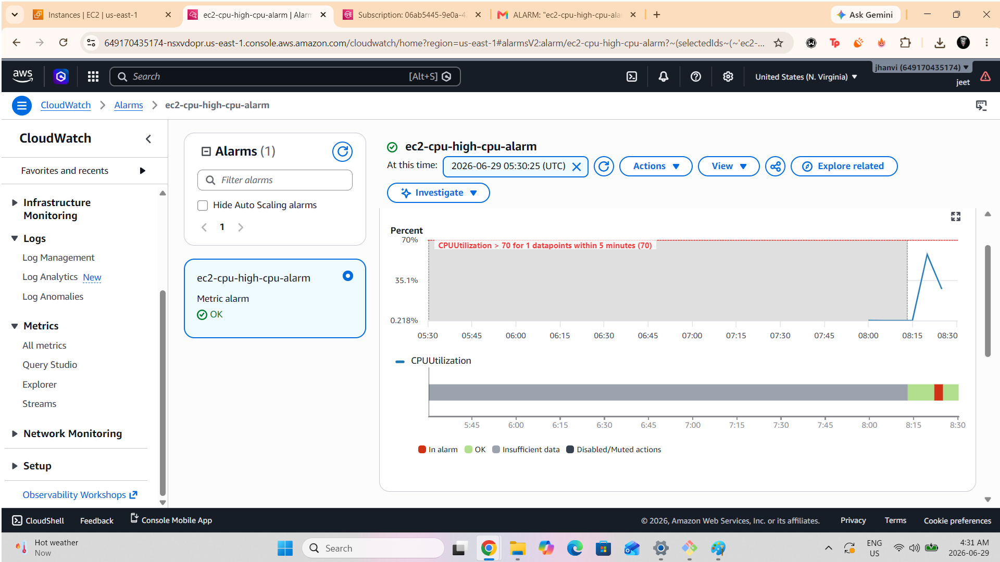  
Threshold, evaluation period, and conditions defined.

---

### 4. SNS Topic Created
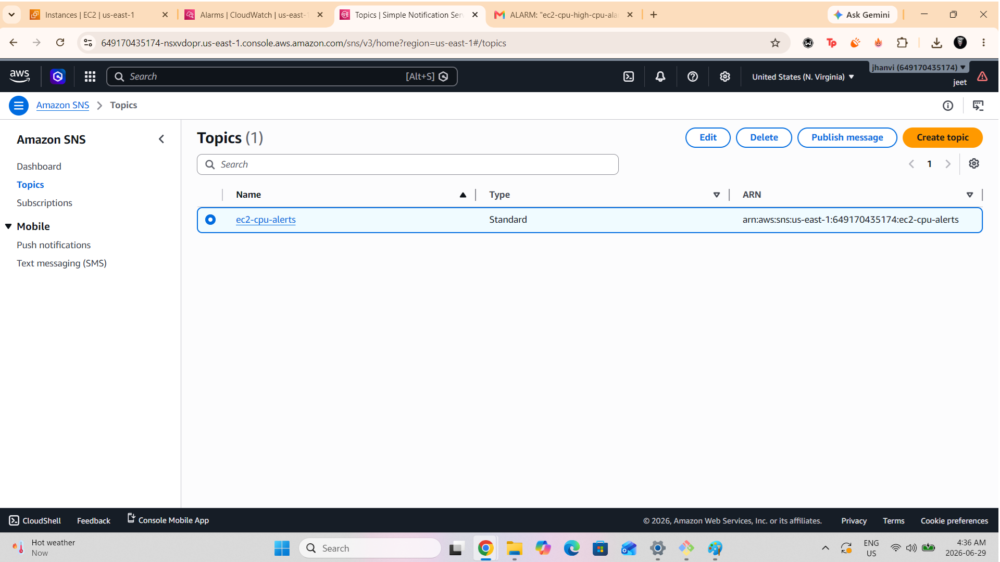
SNS topic created for email notifications.

---

### 5. SNS Subscription Confirmed
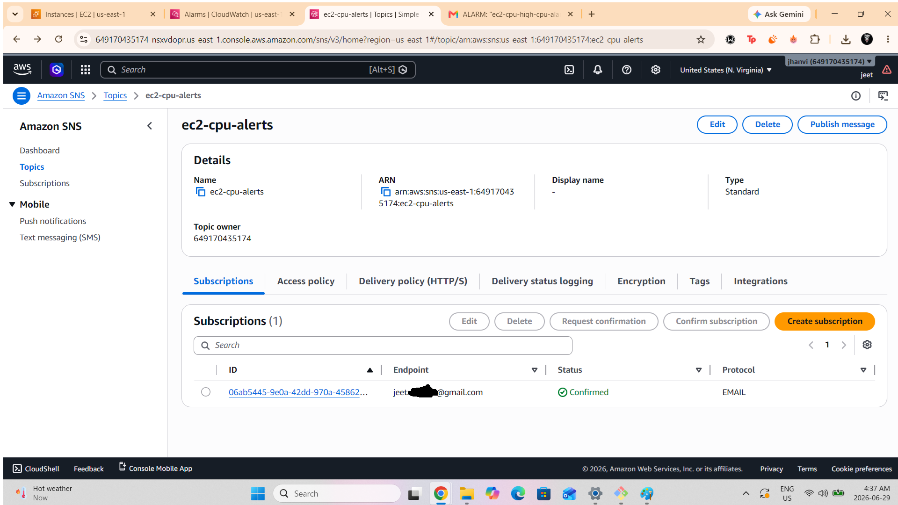
Email subscription successfully confirmed.

---

### 6. EC2 SSH Connection
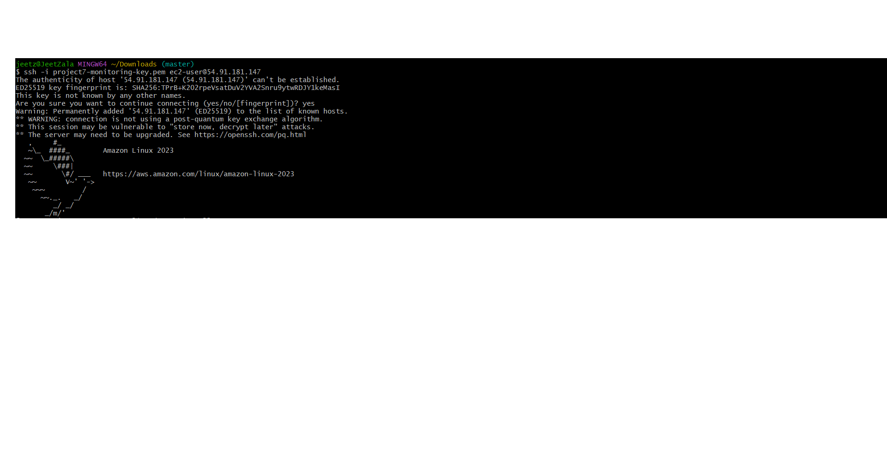
Connection Successful

### 7. CPU Stress Test
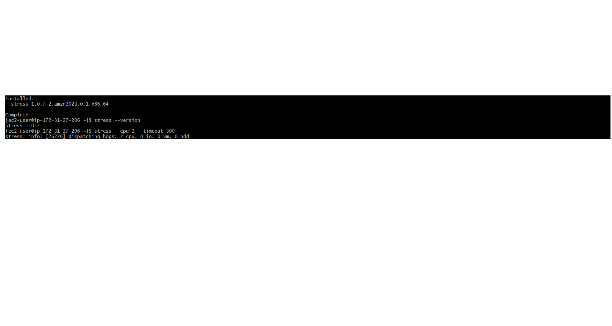
stress --cpu 2 --timeout 300

### 8. CloudWatch Alarm Triggered
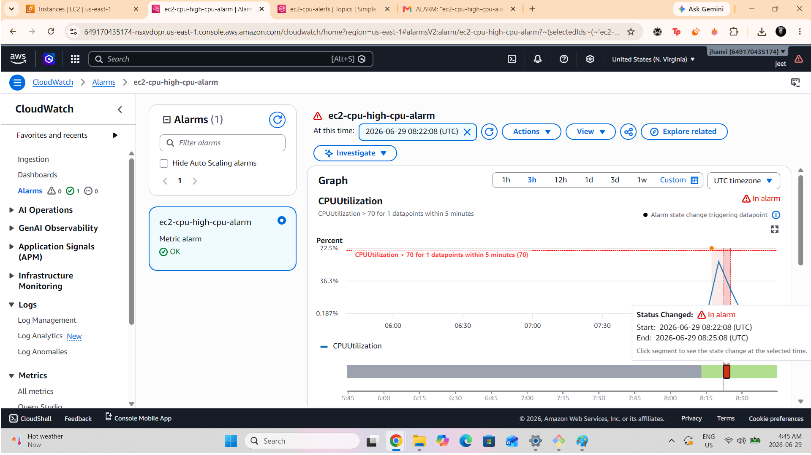
Alarm state changed to ALARM due to high CPU usage.

### 9. SNS Email Notification
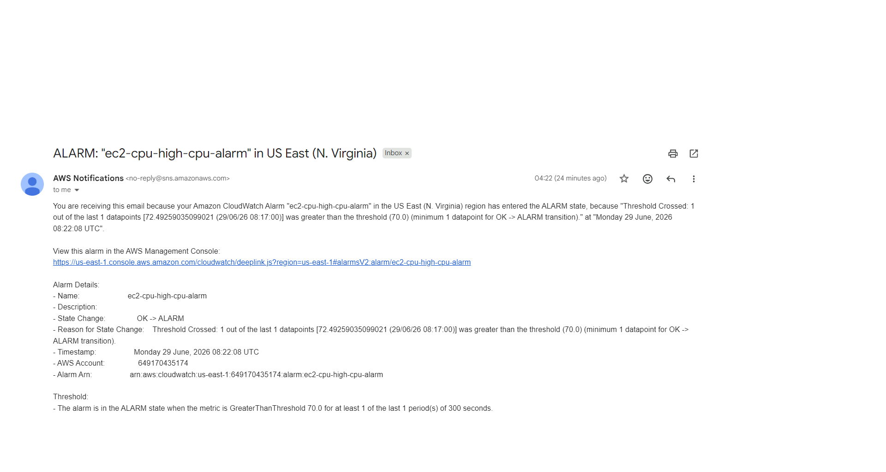
Email alert successfully received.

### 10. Alarm Back to OK State
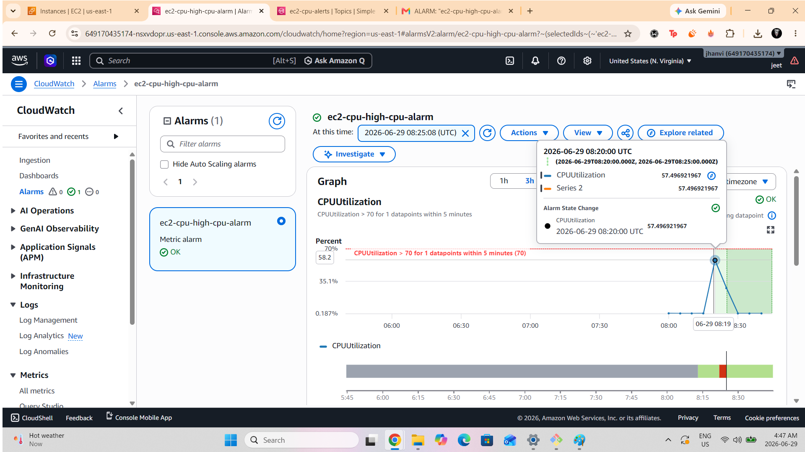
CPU normalized and alarm returned to OK state.

📁 Screenshot Directory Structure
/screenshots
 ├── ec2-instance-running.png
 ├── cloudwatch-alarm-created.png
 ├── alarm-configuration-details.png
 ├── sns-topic-created.png
 ├── sns-subscription-confirmed.png
 ├── ec2-ssh-connected.png
 ├── cpu-stress-test-running.png
 ├── cloudwatch-alarm-triggered.png
 ├── sns-email-notification.png
 ├── alarm-back-to-ok.png
 └── architecture-diagram.png
 
📊 Key Learnings
AWS CloudWatch monitoring & metrics
Alarm creation & threshold tuning
SNS email notification system
EC2 performance testing using stress tool
Real-time cloud observability pipeline
🚀 Outcome

✔ Fully functional monitoring system
✔ Real-time CPU-based alerting
✔ Email notification system working
✔ Hands-on AWS DevOps observability experience

👨‍💻 Author

Jeet Zala
AWS Cloud & DevOps Portfolio Project
